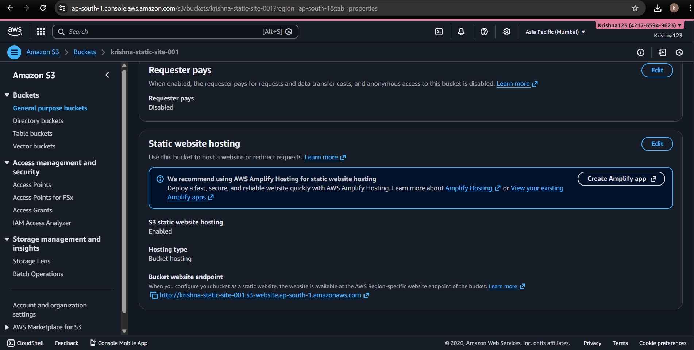
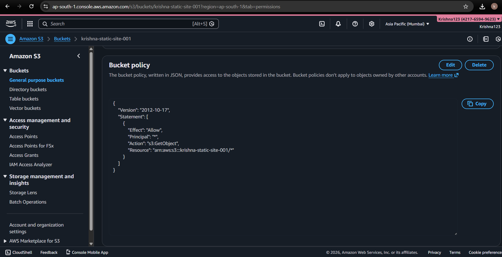

# AWS S3 Static Website Hosting

## Overview
Deployed a static website using Amazon S3 static website hosting.  
This project demonstrates core cloud computing fundamentals including object storage, IAM access management, bucket policies, and troubleshooting permission-related issues.

## Architecture
Client (Browser) → Amazon S3 Static Website Endpoint → HTML Objects

## AWS Services Used
- Amazon S3 (Object Storage, Static Website Hosting)
- AWS IAM (Users, Policies, Least Privilege Access)

## Key Implementations
- Hosted a publicly accessible static website on Amazon S3
- Enabled S3 static website hosting with index document configuration
- Configured S3 bucket policy to allow public read (`s3:GetObject`)
- Created an IAM user with limited permissions following least-privilege principles
- Avoided use of AWS root account for day-to-day operations
- Diagnosed and resolved `403 AccessDenied` errors during deployment

## Security Considerations
- AWS root account access restricted and not used for deployment
- IAM user created with scoped S3 permissions
- Public access enabled only at the object level via bucket policy
- No write or delete permissions granted to anonymous users

## Deployment Workflow
1. Created an Amazon S3 bucket with a globally unique name
2. Enabled static website hosting and configured index document
3. Uploaded HTML files to the S3 bucket
4. Applied bucket policy for public read access
5. Created IAM user and assigned appropriate permissions
6. Verified deployment using S3 website endpoint

## Live Website
http://krishna-static-site-001.s3-website.ap-south-1.amazonaws.com/

## Screenshots
Below are screenshots demonstrating the configuration and deployment of the project:

### S3 Static Website Configuration

### S3 Bucket Policy (Public Read Access)

### IAM User with Least-Privilege Permissions

### Live Website Output

## Key Learnings
- Differences between AWS root user and IAM users
- Importance of least-privilege access control
- How S3 static website hosting works internally
- How bucket policies control public access
- Common causes of S3 `403 AccessDenied` errors

## Future Enhancements
- Add CloudFront distribution for HTTPS and CDN support
- Implement versioning and lifecycle policies
